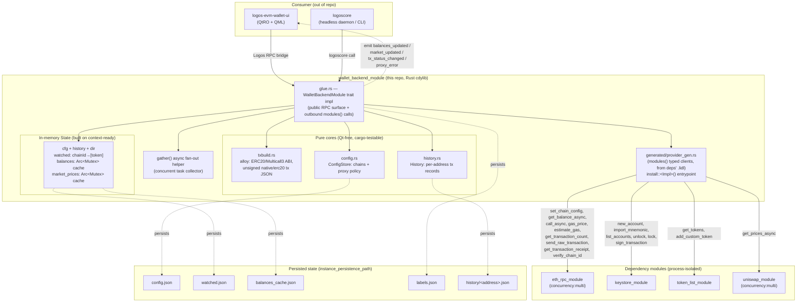
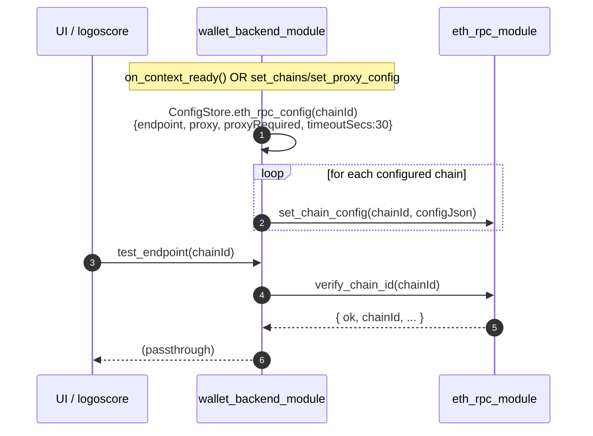
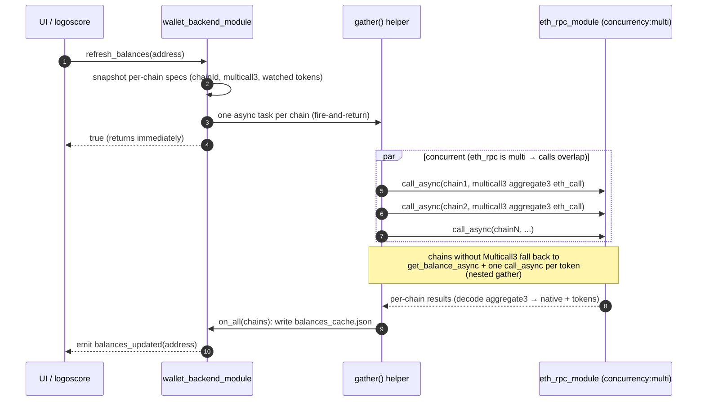

# `wallet_backend_module` — Specification & Reference

`logos-evm-wallet-backend-module` is the **coordinator** (orchestrator) of the
Logos multi-chain EVM wallet. It is a rust-first **cdylib Logos module** that owns
the wallet's central configuration, drives every other wallet module over the
Logos inter-module RPC bridge, and folds in an **offline tx-builder** (alloy ABI /
transaction construction). Concretely, this module:

- owns the **single source of truth** for chains and the proxy policy, and **pushes
  each chain's `{ endpoint, proxy, proxyRequired, timeoutSecs }` down into
  `eth_rpc_module`** (`set_chain_config`) so all chain traffic flows through the
  same fail-closed network policy;
- fetches **multi-chain balances** by fanning out **one async `eth_rpc` call per
  chain** (a single **Multicall3 `aggregate3`** `eth_call` per chain, with a native +
  per-token fallback), gathered into one aggregate and cached;
- runs the **send pipeline** end to end: **build** (alloy, offline) → **sign**
  (keystore) → **broadcast** (eth_rpc) → **record** (local history);
- exposes **market data** for held tokens by fanning out **one
  `uniswap.get_prices` per chain** and merging the prices with cached balances and
  token-list metadata;
- stores this wallet's **own transaction history** — the only history available
  without a proprietary indexer, because it records the txs it itself broadcasts.

It is the central hub of the wallet: it depends on **four** other modules and is in
turn driven by **`logos-evm-wallet-ui`** (the QtRO + QML front-end).

---

## 1. Where this repo sits in the EVM wallet system

The EVM wallet is a set of process-isolated Logos modules. Each module exposes
methods over a typed RPC bridge; callers reach a dependency through a generated
client (`modules().<dep>.<method>(...)`). The seven repos:

| Repo | Kind | Role relative to this module |
|------|------|------------------------------|
| `logos-evm-net-proxy` | plain Rust **library** (not a module) | Fail-closed HTTP/RPC client; the privacy chokepoint vendored by eth-rpc & token-list. Not a direct dependency here. |
| `logos-evm-keystore-module` | Rust cdylib module | **Dependency.** Key management + signing. Private keys never leave it. |
| `logos-evm-eth-rpc-module` | Rust cdylib module, `concurrency:"multi"` | **Dependency.** Multi-chain JSON-RPC transport, fail-closed via net-proxy. |
| `logos-evm-token-list-module` | Rust cdylib module | **Dependency.** Token metadata per chain, fail-closed via net-proxy. |
| `logos-evm-uniswap-module` | Rust cdylib module, `concurrency:"multi"` | **Dependency.** Uniswap price oracle (and swap building). |
| **`logos-evm-wallet-backend-module`** | **Rust coordinator + tx builder (alloy)** | **THIS REPO.** Orchestrates the four modules above. |
| `logos-evm-wallet-ui` | universal C++ `ui_qml` module | **Consumer.** Standalone app that drives this module over the Logos bridge (tabs incl. Market). |

This module's `metadata.json` declares its four dependencies explicitly:

```json
"dependencies": ["eth_rpc_module", "keystore_module", "token_list_module", "uniswap_module"]
```

> **Important — no automatic dependency resolution at load time.** `logoscore`'s
> `load-module` does **not** auto-resolve module dependencies. All four dependency
> modules **must be installed and loaded first** (in any order), then
> `wallet_backend_module` loaded last. The runtime doc-test loads all five
> explicitly:
> ```bash
> for m in eth_rpc_module keystore_module token_list_module uniswap_module wallet_backend_module; do
>   logoscore load-module "$m"
> done
> ```

---

## 2. Overall architecture



**Internal structure (files under `rust-lib/src/`):**

- **`lib.rs`** — crate root. Declares the three pure modules (`config`, `history`,
  `txbuild`), re-exports them, and gates `glue` behind the default `logos_module`
  feature. The pure cores compile and test **without** the SDK
  (`cargo test --no-default-features`).
- **`glue.rs`** — the Logos module glue: the `WalletBackendModule` trait (the public
  API), the `WalletBackendModuleEvents` trait (outbound events), the
  `WalletBackendModuleImpl` implementation, the `gather`/`fetch_chain_async`
  balance fan-out, the market fan-out, the send pipeline (`do_send`), and the
  `logos_module_install` entry point. `include!`s the build-time-generated
  `generated/provider_gen.rs`, which provides `modules()` (typed dependency
  clients), `RustModuleContext`, the `emit_*` event functions, and `install::<T>()`.
- **`txbuild.rs`** — offline ABI / tx construction with **alloy** (`sol!` macro).
  No network, no keys.
- **`config.rs`** — `ConfigStore`: chains + proxy policy, with the canonical default
  chain set, JSON persistence, and the `eth_rpc_config` payload builder.
- **`history.rs`** — `History`: one JSON file per account address; add / list /
  update-status with normalized (lowercased, `0x`-stripped) address keys.

**Transport / codegen:** `metadata.json` declares
`codegen.rust = { crate: "rust-lib", trait: "WalletBackendModule", source: "src/glue.rs" }`.
The module builder reads the trait from `glue.rs` and the dependency contracts (the
deps' published `.lidl`), and generates `generated/provider_gen.rs` (the
`modules()` typed clients and the install/event scaffolding). The crate is built as
a `staticlib`/`rlib` (`crate-type = ["staticlib", "rlib"]`) and wrapped into the
cdylib plugin by the C++ `logos_module()` CMake macro.

---

## 3. Communication with dependencies

The coordinator never talks to a chain or a key directly — it composes its four
dependencies. The richest flows are the **send pipeline**, the **concurrent
balance fan-out**, the **chain-config push-down**, and the **market fan-out**.

### 3.1 Chain-config push-down (on context-ready and on every config change)



`push_chain_configs` runs at startup (`on_context_ready`) and after every
`set_chains` / `set_proxy_config`, so eth-rpc always reflects the central policy.
This is how the wallet's proxy policy reaches the network layer.

### 3.2 Send pipeline — `send_native` / `send_erc20` (`do_send`)

```mermaid
sequenceDiagram
  autonumber
  participant Caller as UI / logoscore
  participant WB as wallet_backend_module
  participant ETH as eth_rpc_module
  participant TXB as txbuild (alloy, in-process)
  participant KS as keystore_module
  participant HIST as History (local file)

  Caller->>WB: send_native(send_json) / send_erc20(send_json)
  WB->>ETH: get_transaction_count(chainId, from)  %% nonce
  ETH-->>WB: { result: "0x.." }
  WB->>ETH: gas_price(chainId)
  ETH-->>WB: { result: "0x.." }  %% maxFee = 2× gasPrice; tip = gasPrice
  WB->>TXB: estimate shape {from,to,value,data}
  WB->>ETH: estimate_gas(chainId, estTxJson)
  ETH-->>WB: { result: "0x.." }  %% fallback 21000 native / 90000 erc20
  WB->>TXB: unsigned_native_tx / unsigned_erc20_tx(...)
  TXB-->>WB: unsigned tx JSON (keystore-signable)
  WB->>KS: sign_transaction(from, unsignedJson, chainId)
  KS-->>WB: { ok, raw: "0x.." }  %% private key never leaves keystore
  WB->>ETH: send_raw_transaction(chainId, raw)
  ETH-->>WB: { ok, hash: "0x.." }
  WB->>HIST: add(from, TxRecord{status:"pending", ...})
  WB-->>Caller: emit tx_status_changed(hash); { ok:true, hash }
```

### 3.3 Concurrent multi-chain balance fan-out — `refresh_balances`



The fan-out fires **one async eth_rpc call per chain** and returns immediately.
Because `eth_rpc_module` is `concurrency:"multi"`, the per-chain calls **overlap**
instead of serializing; the `wallet-backend-fanout` doc-test proves
**peak == 4** for four chains (a `"single"` eth-rpc would yield peak 1). The final
completion writes the cache and emits `balances_updated`.

### 3.4 Market fan-out — `refresh_market` / `get_market`

```mermaid
sequenceDiagram
  autonumber
  participant Caller as UI (Market tab)
  participant WB as wallet_backend_module
  participant TL as token_list_module
  participant G as gather() helper
  participant UNI as uniswap_module (concurrency:multi)

  Caller->>WB: refresh_market(address)
  WB->>WB: read cached balances; pick held tokens (balance > 0) per chain
  loop per chain
    WB->>TL: get_tokens(chainId)  %% decimals/symbol metadata
    TL-->>WB: { tokens:[{address,symbol,decimals}] }
  end
  WB->>G: one async task per chain → uniswap.get_prices_async
  WB-->>Caller: true (returns immediately)
  par concurrent (uniswap is multi)
    G->>UNI: get_prices_async(chain1, {tokens:[{address,decimals}]})
    G->>UNI: get_prices_async(chainN, ...)
  end
  UNI-->>G: { prices:[{address, eth, usd}] }
  G->>WB: cache market_prices (ephemeral); emit market_updated(address)
  Caller->>WB: get_market(address)
  WB->>TL: get_tokens(chainId) (symbol/decimals)
  WB-->>Caller: { ok, address, chains:[{chainId, items:[{symbol, balance, usd, valueUsd, ...}]}] }
```

`refresh_market` populates the ephemeral `market_prices` cache concurrently;
`get_market` then reads that cache, joins it with cached balances + token-list
metadata, and computes `valueUsd` per holding (degrading to `null` prices on
failure — the holding still shows).

### 3.5 Other passthroughs

| This module's method | Dependency call(s) it makes |
|---|---|
| `create_account` | `keystore_module.new_account(passphrase)` then persists the label locally |
| `import_mnemonic` | `keystore_module.import_mnemonic(phrase_json)` then persists the label |
| `list_accounts` | `keystore_module.list_accounts()` (passthrough) |
| `unlock` / `lock` | `keystore_module.unlock(address, passphrase)` / `keystore_module.lock(address)` |
| `get_tokens` | `token_list_module.get_tokens(chainId)` (passthrough) |
| `add_custom_token` | `token_list_module.add_custom_token(token_json)` |
| `test_endpoint` | `eth_rpc_module.verify_chain_id(chainId)` (passthrough) |
| `refresh_tx_status` | `eth_rpc_module.get_transaction_receipt(chainId, hash)` |

---

## 4. Full API reference

All methods are declared in the `WalletBackendModule` trait (`rust-lib/src/glue.rs`)
and are reachable over the Logos bridge as
`wallet_backend_module.<method>(...)`. **Argument convention:** the Logos RPC layer
passes scalars (`i64`) and **strings**; JSON-shaped arguments are passed as JSON
**strings** (with `logoscore`, `@file.json` loads a file as the argument).

**Reply convention:** methods returning `String` return a JSON object. Success is
`{"ok": true, ...}`; error is `{"ok": false, "error": "<message>"}` (the `err()`
helper). Methods returning `bool` return `true`/`false` (and `false` on bad input
or uninitialized state). When the backend is called before `on_context_ready`,
state-touching methods return `{"ok":false,"error":"backend not initialized
(context not ready)"}` (or `false` for bool methods).

### 4.1 Central configuration

#### `set_proxy_config(proxy_json: String) -> bool`
Set the wallet-wide proxy policy and immediately push it into every chain in
eth-rpc. `proxy_json` is a `ProxySettings` object:

| Field | Type | Meaning |
|---|---|---|
| `proxy` | `string \| null` | SOCKS proxy URL, e.g. `"socks5h://127.0.0.1:9050"` |
| `proxyRequired` | `bool` (default `false`) | If true, eth-rpc must refuse to send without the proxy (fail-closed) |

Returns `true` on success, `false` on malformed JSON or uninitialized state.
Side effect: calls `push_chain_configs` → `eth_rpc_module.set_chain_config(...)`
for every chain.

```bash
logoscore call wallet_backend_module set_proxy_config '{"proxy":"socks5h://127.0.0.1:9050","proxyRequired":true}'
```

#### `get_proxy_config() -> String`
Returns the current proxy policy: `{"ok": true, "proxy": {"proxy": "...", "proxyRequired": true}}`.

#### `set_chains(chains_json: String) -> bool`
Replace the configured chain set and push each chain's config into eth-rpc.
`chains_json` is a JSON **array** of `ChainInfo` (camelCase):

| Field | Type | Meaning |
|---|---|---|
| `chainId` | `u64` | EVM chain id |
| `name` | `string` | Display name |
| `rpcUrl` | `string` | JSON-RPC endpoint pushed into eth-rpc as `endpoint` |
| `nativeSymbol` | `string` | Native currency symbol (e.g. `ETH`, `POL`) |
| `multicall3` | `string \| null` (default null) | Multicall3 address; null ⇒ canonical `0xcA11…CA11` |
| `explorer` | `string \| null` (default null) | Block explorer base URL |

Returns `true` on success; `false` on malformed JSON / uninitialized state.

```bash
logoscore call wallet_backend_module set_chains @chains.json
# chains.json: [ { "chainId":1337, "name":"Mock", "rpcUrl":"http://127.0.0.1:8602", "nativeSymbol":"ETH" } ]
```

#### `get_chains() -> String`
Returns `{"ok": true, "chains": [ChainInfo, ...]}`.

#### `test_endpoint(chain_id: i64) -> String`
Verify the chain's RPC endpoint by asking eth-rpc to confirm the chain id.
Passthrough of `eth_rpc_module.verify_chain_id(chain_id)`; the success reply
contains a `chainId` field. Errors surface as `{"ok": false, "error": ...}`.

### 4.2 Accounts (signing stays in the keystore)

#### `create_account(passphrase: String, label: String) -> String`
Create a new keystore account. Calls `keystore_module.new_account(passphrase)`,
then persists `address → label` in `labels.json` (lowercased key). Returns the
keystore reply verbatim (typically `{"ok": true, "address": "0x..."}`).

```bash
logoscore call wallet_backend_module create_account "my-passphrase" "savings"
```

#### `import_mnemonic(phrase_json: String, label: String) -> String`
Import an account from a BIP-39 mnemonic. `phrase_json` is forwarded to
`keystore_module.import_mnemonic`; the doc-test uses the shape:

```json
{ "phrase": "test test test ... junk", "accountIndex": 0, "password": "pw" }
```

Persists `address → label` on success and returns the keystore reply (containing
`address`).

```bash
logoscore call wallet_backend_module import_mnemonic @mnemonic.json main
```

#### `list_accounts() -> String`
Passthrough of `keystore_module.list_accounts()` (the keystore's account list JSON).

#### `unlock(address: String, passphrase: String) -> bool`
Unlock an account for signing. Passthrough of
`keystore_module.unlock(address, passphrase)`; returns `true`/`false`.

#### `lock(address: String) -> bool`
Lock an account. Passthrough of `keystore_module.lock(address)`.

### 4.3 Watched tokens (per-chain, persisted locally)

#### `set_watched_tokens(chain_id: i64, addresses_json: String) -> bool`
Set the list of token contract addresses to track on a chain (these are the
ERC-20s included in balance refresh). `addresses_json` is a JSON **array of
strings**. Persisted to `watched.json`. Returns `true`/`false`.

```bash
logoscore call wallet_backend_module set_watched_tokens 1 '["0xA0b8...eB48"]'
```

#### `get_watched_tokens(chain_id: i64) -> String`
Returns `{"ok": true, "tokens": ["0x...", ...]}` (empty array if none).

### 4.4 Tokens (token-list passthrough)

#### `get_tokens(chain_id: i64) -> String`
Passthrough of `token_list_module.get_tokens(chain_id)` — the merged token list for
the chain (`{"tokens": [{"address","symbol","decimals", ...}]}`).

#### `add_custom_token(token_json: String) -> bool`
Forward a user-supplied token to `token_list_module.add_custom_token(token_json)`.
Returns `true`/`false`.

### 4.5 Balances (Multicall3-batched, concurrent)

#### `refresh_balances(address: String) -> bool`
Refresh balances for `address` across **every configured chain concurrently**.
Fires one async eth-rpc call per chain (a single Multicall3 `aggregate3` `eth_call`
when a Multicall3 address is known, else native `eth_getBalance` + one `eth_call`
per watched token via a nested gather) and **returns `true` immediately**. When all
chains complete, writes `balances_cache.json` and emits `balances_updated(address)`.
Returns `false` only on an unparseable address or uninitialized state.

```bash
logoscore call wallet_backend_module refresh_balances 0xf39f...2266
```

#### `get_balances(address: String) -> String`
Read the cached aggregate written by the last `refresh_balances`:
```json
{ "ok": true, "balances": {
    "address": "0x...",
    "chains": [ { "chainId": 1, "native": "1000000000000000000",
                  "tokens": [ { "address": "0x...", "balance": "0" } ] } ] } }
```
If nothing is cached yet, returns `{"ok": true, "balances": {"address": "...", "chains": []}}`.

### 4.6 Market (Uniswap prices for held tokens, concurrent)

#### `refresh_market(address: String) -> bool`
Refresh USD/ETH prices for the address's **held** tokens (balance > 0) across all
chains **concurrently** — one `uniswap_module.get_prices_async` per chain — caches
them in the ephemeral `market_prices` map, and emits `market_updated(address)`.
Returns `true` immediately. If no balances are cached yet, it emits
`market_updated` and returns `true` (so a waiting UI is unblocked).

```bash
logoscore call wallet_backend_module refresh_market 0xf39f...2266
```

#### `get_market(address: String) -> String`
Build the **Market** view from cached balances + token-list metadata + the cached
Uniswap prices. Pricing failures degrade to `null` prices (the holding still
shows). Shape:
```json
{ "ok": true, "address": "0x...",
  "chains": [ { "chainId": 1, "items": [
    { "address": "native", "symbol": "ETH", "decimals": 18,
      "balance": "...", "eth": 1.0, "usd": 3000.0, "valueUsd": 3000.0 },
    { "address": "0x...", "symbol": "USDC", "decimals": 6,
      "balance": "...", "eth": 0.0003, "usd": 1.0, "valueUsd": 12.34 } ] } ] }
```
`valueUsd = balance / 10^decimals * usd`. If no balances are cached, returns
`{"ok": true, "address": "...", "chains": []}`.

### 4.7 Send

All three take a `send_json` string deserialized into `SendParams`:

| Field (camelCase in) | Type | Meaning |
|---|---|---|
| `from` | `string` | Sender address (must be unlocked in the keystore) |
| `to` | `string` | Recipient address |
| `chainId` | `u64` | Chain to send on |
| `amount` | `string` (default `""`) | wei (native) or token base units (erc20); decimal or `0x`-hex |
| `tokenAddress` | `string` (default `""`) | ERC-20 contract (erc20 sends only) |

#### `estimate_fee(send_json: String) -> String`
Estimate the fee **without** signing or broadcasting. Reads `gas_price` from
eth-rpc and uses a fixed gas estimate (21 000 native, 90 000 erc20 — based on
whether `tokenAddress` is set). Returns:
```json
{ "ok": true, "gasPrice": "<wei>", "gasLimit": 21000, "feeWei": "<gasPrice*gasLimit>" }
```

#### `send_native(send_json: String) -> String`
Run the full pipeline for a native-ETH transfer: fetch nonce
(`get_transaction_count`) and `gas_price`, derive an EIP-1559 fee
(`maxFeePerGas = 2 × gasPrice`, `maxPriorityFeePerGas = gasPrice`),
`estimate_gas` (fallback 21 000), build the unsigned tx (alloy),
`keystore.sign_transaction`, `eth_rpc.send_raw_transaction`, record a `pending`
`TxRecord` in history, emit `tx_status_changed(hash)`. Returns
`{"ok": true, "hash": "0x..."}` (or an error object — e.g. account locked, RPC
failure).

```bash
logoscore call wallet_backend_module send_native @send.json
```

#### `send_erc20(send_json: String) -> String`
Same pipeline for an ERC-20 transfer: builds an `erc20 transfer(to, amount)`
calldata tx targeting `tokenAddress` (value `0`), default gas 90 000. Requires a
valid `tokenAddress`. Returns `{"ok": true, "hash": "0x..."}` or an error object.

### 4.8 History

#### `get_history(address: String) -> String`
Return this wallet's recorded transactions for `address` (newest first):
```json
{ "ok": true, "history": [ {
    "hash": "0x...", "chainId": 1, "from": "0x...", "to": "0x...",
    "value": "<wei or units>", "kind": "native" | "erc20",
    "token": "0x..." | null, "status": "pending" | "confirmed" | "failed",
    "timestamp": 1718000000 } ] }
```
Address keys are normalized (lowercased, `0x`-stripped) so the same account
resolves regardless of prefix/case.

#### `refresh_tx_status(hash_hex: String, chain_id: i64) -> String`
Poll the receipt via `eth_rpc.get_transaction_receipt(chain_id, hash)` and map it:
- `result == null`/absent → `"pending"`
- receipt `status == "0x1"` → `"confirmed"`
- otherwise → `"failed"`

On a non-pending result it updates the stored record's status across the history
files, then emits `tx_status_changed(hash)`. Returns
`{"ok": true, "status": "pending"|"confirmed"|"failed"}`.

### 4.9 Events (`WalletBackendModuleEvents`)

Emitted to subscribers over the Logos bridge (consumed by the UI):

| Event | Emitted when | Payload |
|---|---|---|
| `balances_updated(address)` | a `refresh_balances` fan-out completes and the cache is written | `address` |
| `market_updated(address)` | a `refresh_market` fan-out completes (or there were no balances to price) | `address` |
| `tx_status_changed(hash_hex)` | a send is recorded, or a `refresh_tx_status` runs | tx `hash` |
| `proxy_error(context)` | declared for a proxy/fail-closed surfacing (declared in the events trait) | `context` |

### 4.10 Lifecycle

#### `on_context_ready(ctx: &RustModuleContext)`
Called once by the runtime when the module's context (including
`instance_persistence_path`) is ready. Builds `State` from disk: seeds/loads
`config.json` (with the default chain set on first run), loads `watched.json` and
`balances_cache.json`, initializes the (empty) `market_prices` cache, and
**immediately pushes all chain configs into eth-rpc** (`push_chain_configs`).
Until this runs, state-touching methods report "backend not initialized".

---

## 5. Configuration & data model

### 5.1 Default chain set (`config::default_chains`)

Seeded on first run if no `config.json` exists:

| chainId | name | rpcUrl | nativeSymbol | explorer |
|---|---|---|---|---|
| 1 | Ethereum | https://eth.llamarpc.com | ETH | https://etherscan.io |
| 10 | Optimism | https://mainnet.optimism.io | ETH | https://optimistic.etherscan.io |
| 42161 | Arbitrum One | https://arb1.arbitrum.io/rpc | ETH | https://arbiscan.io |
| 8453 | Base | https://mainnet.base.org | ETH | https://basescan.org |
| 137 | Polygon | https://polygon-rpc.com | POL | https://polygonscan.com |
| 11155111 | Sepolia | https://ethereum-sepolia-rpc.publicnode.com | ETH | https://sepolia.etherscan.io |

### 5.2 The `eth_rpc` config payload (`ConfigStore::eth_rpc_config`)

For each chain, the backend pushes this **camelCase** payload into
`eth_rpc_module.set_chain_config(chainId, …)` (matching eth-rpc's `ChainConfig`):
```json
{ "endpoint": "<chain.rpcUrl>",
  "proxy": "<proxy.proxy or null>",
  "proxyRequired": <proxy.proxyRequired>,
  "timeoutSecs": 30 }
```
This is the seam that pushes the wallet's proxy policy down to the network layer.

### 5.3 Multicall3

The canonical Multicall3 address is
`0xcA11bde05977b3631167028862bE2a173976CA11` (`txbuild::MULTICALL3`); a chain may
override it via `ChainInfo.multicall3`, else `multicall3_addr()` defaults to the
canonical one. `aggregate3` is encoded with `allowFailure = true` on every call,
so a single reverting `balanceOf` degrades to a zero balance rather than sinking
the whole batch.

### 5.4 Unsigned-tx JSON (what the keystore signs)

`txbuild::unsigned_native_tx` / `unsigned_erc20_tx` produce the JSON the keystore
consumes (snake_case fields):
```json
{ "to": "0x...", "value": "0x...", "nonce": "0x...", "gas_limit": "0x...",
  "data": "0x...",
  "fee_mode": "eip1559", "max_fee_per_gas": "0x...", "max_priority_fee_per_gas": "0x..." }
```
For `Fee::Legacy`, `fee_mode` is `"legacy"` with a single `gas_price`. ERC-20 txs
set `to` = token contract, `value` = `0x0`, and `data` = `transfer(to, amount)`
calldata.

### 5.5 Persisted files (under `instance_persistence_path`)

| File | Written by | Shape |
|---|---|---|
| `config.json` | `ConfigStore` | `{ chains: [ChainInfo], proxy: ProxySettings }` |
| `watched.json` | `set_watched_tokens` | `{ "<chainId>": ["0x...", ...] }` |
| `balances_cache.json` | `refresh_balances` completion | `{ "<address>": { address, chains: [...] } }` |
| `labels.json` | `create_account` / `import_mnemonic` | `{ "<lowercased address>": "<label>" }` |
| `history/<address>.json` | `History` | `[TxRecord, ...]` newest-first, address-keyed (lowercased, `0x`-stripped) |

`market_prices` is **in-memory only** (ephemeral, not persisted): `chainId →
{ tokenAddress → (ethPrice, usdPrice) }`.

---

## 6. Build, run & test

### 6.1 Build

```bash
# Pure cores only (txbuild incl. Multicall3, config, history) — no SDK needed:
cd rust-lib && cargo test --no-default-features

# Full module (cdylib plugin) via nix:
nix build .#install      # -> result/modules/wallet_backend_module/
nix build .#lgx          # -> a distributable .lgx package
```

Building the full module pulls the four dependency modules' published `.lidl`
contracts to generate the typed `modules().<dep>` clients (the `generated/`
directory, gitignored). In the Logos workspace these resolve via flake
`follows` / `--override-input` to local checkouts; standalone they build once the
dependency repos' default branches carry the matching code.

`flake.nix` wires the four dependency module flakes with
`inputs.logos-module-builder.follows = "logos-module-builder"` (and uniswap also
`follows` `eth_rpc_module`) so every module shares one builder, and calls
`logos-module-builder.lib.mkLogosModule { src; configFile = ./metadata.json; flakeInputs; }`.

### 6.2 Run / drive via logoscore

`load-module` does **not** auto-resolve dependencies, so install and load all five
modules:

```bash
# install the five .lgx into ./modules with lgpm, then:
logoscore -D -m ./modules &                       # start the daemon
for m in eth_rpc_module keystore_module token_list_module uniswap_module wallet_backend_module; do
  logoscore load-module "$m"
done

logoscore call wallet_backend_module set_chains @chains.json        # pushes config into eth-rpc
logoscore call wallet_backend_module test_endpoint 1337
logoscore call wallet_backend_module import_mnemonic @mnemonic.json main
logoscore call wallet_backend_module unlock <address> pw
logoscore call wallet_backend_module send_native @send.json        # → { "ok": true, "hash": "0x..." }
logoscore call wallet_backend_module get_history <address>         # → status "pending"
```

(`logos-evm-wallet-ui` drives the same RPC surface from a QtRO + QML standalone
app, including the Market tab backed by `refresh_market` / `get_market`.)

### 6.3 How the doc-tests exercise it

Two executable doc-tests live under `doctests/` (run with `doctests/run.sh`, which
invokes the shared `logos-doctest` CLI; CI runs them on Linux + macOS via
`.github/workflows/doctests.yml`):

- **`wallet-backend-runtime.test.yaml`** — loads **all five** modules into a
  `logoscore` daemon and drives the **send pipeline** against a local mock
  JSON-RPC node (chainId 1337). It configures the chain (push-down into eth-rpc),
  imports Foundry's known test account, unlocks it, sends a 1-ETH native transfer,
  and asserts the returned `hash` and that the tx lands in local history as
  `pending`.
- **`wallet-backend-fanout.test.yaml`** — points **four** chains at a concurrent,
  peak-tracking mock node (a `ThreadingHTTPServer` that holds each request open
  ~400 ms and records the peak in-flight count), fires `refresh_balances`, and
  asserts **`peak == 4`** — proving the per-chain `eth_call`s overlap because
  `eth_rpc_module` is `concurrency:"multi"`.

---

## 7. Security & invariants

- **Keys never leave the keystore.** Signing happens only in `keystore_module`
  (`sign_transaction` returns the `raw` signed tx). This module builds the
  **unsigned** tx (alloy, offline) and broadcasts the keystore-signed `raw`; it
  never touches a private key or mnemonic plaintext (it only forwards
  `import_mnemonic`'s phrase JSON to the keystore).
- **Fail-closed networking is centralized.** The proxy policy
  (`proxy` + `proxyRequired`) is owned here and pushed into eth-rpc as part of
  every chain config. With `proxyRequired = true`, eth-rpc (which wraps the
  fail-closed `net-proxy` client) refuses to send without a valid SOCKS proxy —
  so the wallet's privacy chokepoint is configured from one place. `proxy_error`
  is the event reserved for surfacing such failures.
- **Local-only history.** This wallet only records the txs **it itself
  broadcasts** — there is no proprietary indexer query — so history is private and
  bounded to wallet-originated activity.
- **Graceful degradation.** Balance and price decode failures degrade to zeros /
  `null` prices (Multicall3 `allowFailure = true`, `decode_*` returning defaults)
  rather than failing the whole refresh — a holding still shows even if it can't be
  priced.

---

## 8. Concurrency (`gather` over `multi` callees)

This module itself is **not** declared `concurrency:"multi"`; it exploits the
multi-concurrency of its **callees** (`eth_rpc_module`, `uniswap_module`). The
mechanism is the dependency-free `gather` helper in `glue.rs`:

```text
gather(tasks, on_all): fire every task; each task issues its async dep call(s)
and hands its result to a `done` callback. A shared Arc<Mutex<(slots, remaining,
on_all)>> collects results in task order; when the last completes, `on_all` fires
once with all results (in order).
```

- **`refresh_balances`** builds one `GatherTask<Value>` per chain
  (`fetch_chain_async`). The common path is a single Multicall3 `call_async`; the
  fallback (`fetch_chain_individual_async`) uses a **nested** `gather` over native
  `get_balance_async` + one `call_async` per token. The outer `on_all` writes the
  cache and emits `balances_updated`.
- **`refresh_market`** builds one task per chain issuing `uniswap.get_prices_async`;
  the `on_all` caches the per-chain price maps and emits `market_updated`.

Because the callees are `concurrency:"multi"`, the fired async calls **overlap**
(the daemon resolves each deferred reply on the caller's behalf via a
pending-sentinel the transport completes transparently), turning N sequential
round-trips into one concurrent wave. The async completion callbacks are `'static`
closures that cannot borrow `&self`, so the methods first **snapshot** what they
need out of `State` and share the caches via `Arc<Mutex<…>>`; the event loop is
single-threaded, so those locks are effectively uncontended.
